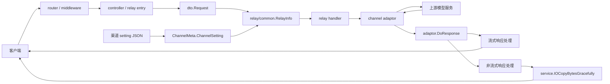
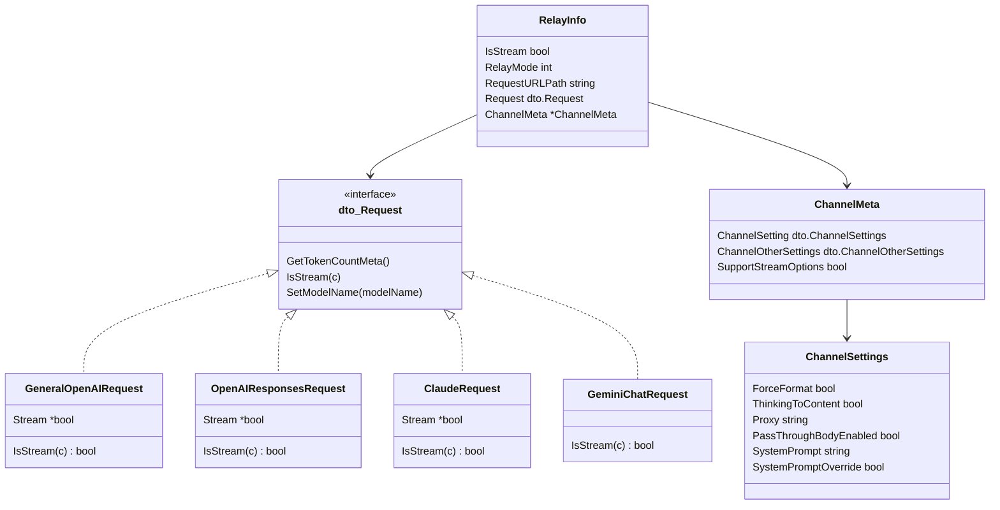
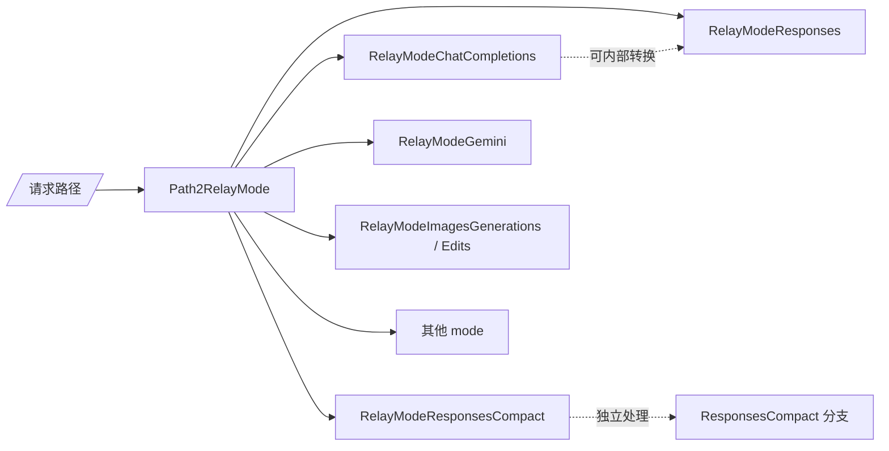
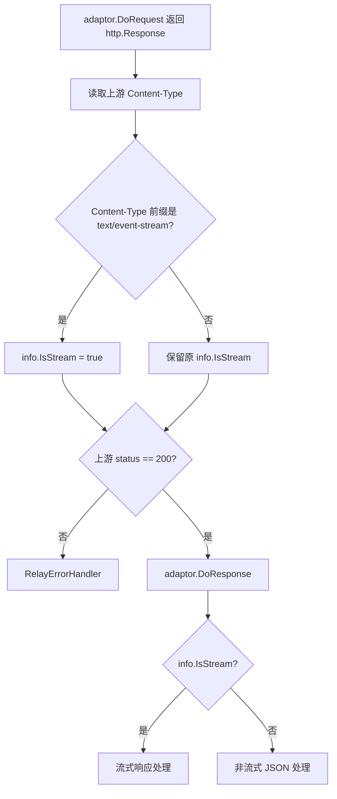
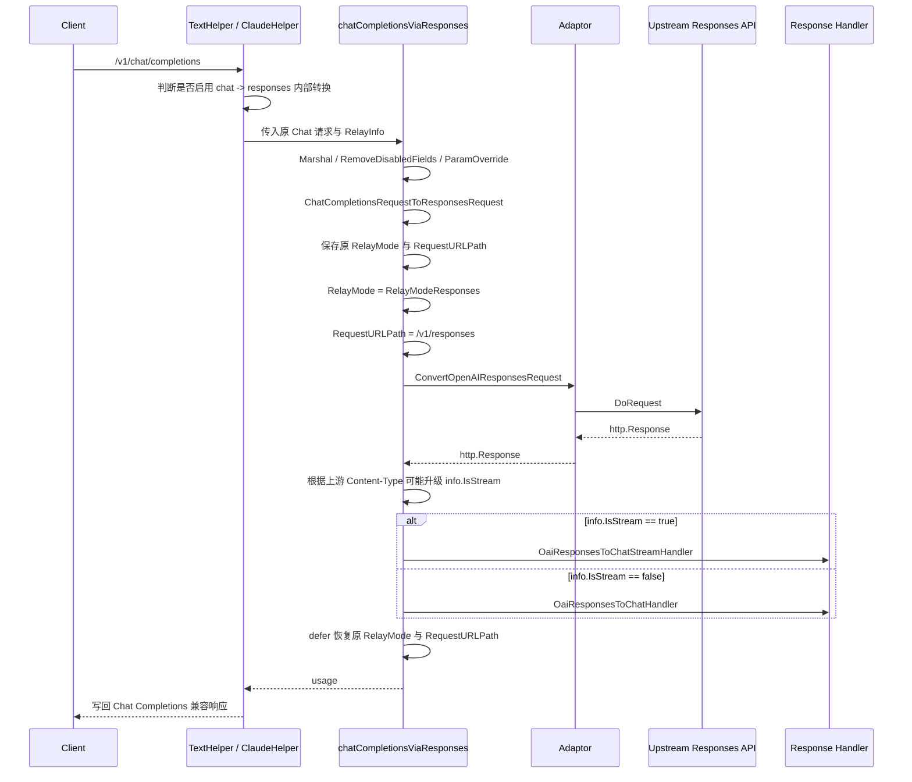
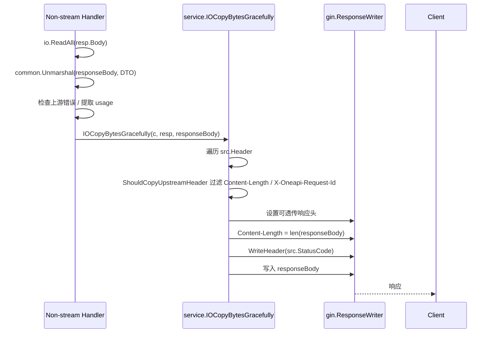
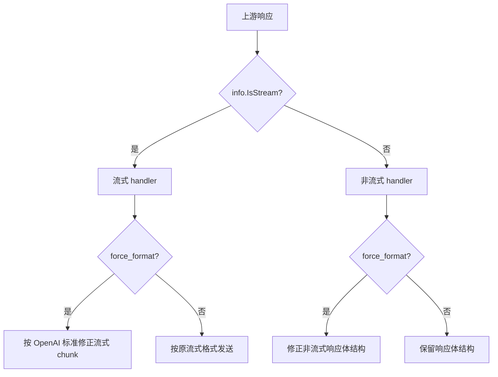
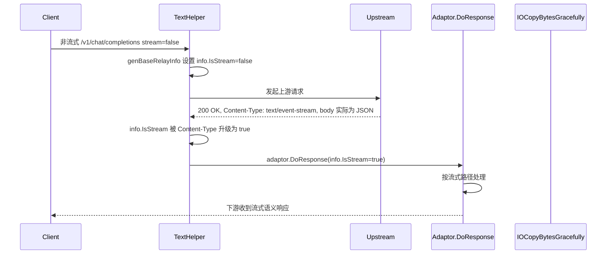
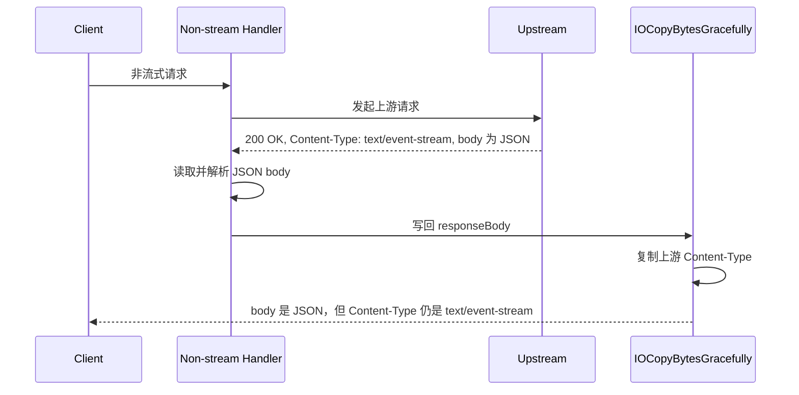

# 渠道响应格式相关原代码说明

本文档说明当前原代码中与“渠道统一响应格式”改动相关的既有行为，重点帮助读者理解修改前的功能设计、调用链和风险点。它不是开发步骤文档，也不描述新能力的最终实现方案。

## 范围

本说明覆盖以下原代码区域：

- 渠道级 `setting` 的后端 DTO 与前端表单序列化。
- `RelayInfo` 的创建、渠道元数据注入与 `IsStream` 初始化。
- 文本、Claude、Gemini、图片、chat-completions-via-responses 等 handler 中基于上游 `Content-Type` 的流式判定。
- `/v1/responses` 与 `/v1/responses/compact` 直接入口的处理差异。
- 非流式响应体写回时的上游响应头复制逻辑。

不覆盖内容：

- OpenAI 请求体里的 `response_format` 参数语义。
- Force Format 的响应体字段修正细节。
- 新增统一响应格式能力的开发 checklist。
- `web/classic` 的渠道表单。

## 原本设计思路

原代码的核心思想是：relay 链路尽量按“客户端请求语义 + 上游响应事实”共同决定最终处理方式。

1. 客户端请求首先被解析成统一的 `dto.Request`，每类请求通过 `IsStream(c)` 暴露是否请求流式响应。
2. `genBaseRelayInfo` 根据当前请求路径推导 `RelayMode`，并把 `request.IsStream(c)` 的结果写入 `RelayInfo.IsStream`。
3. handler 发起上游请求后，会再次观察上游响应头。如果上游返回 `Content-Type: text/event-stream`，部分 handler 会把 `info.IsStream` 升级为 `true`。
4. adaptor 的 `DoResponse` 再根据 `info.IsStream` 选择流式 handler 或非流式 handler。
5. 非流式 handler 通常完整读取上游响应体，解析 JSON，完成错误检查、usage 提取或格式转换后，调用统一写回函数 `service.IOCopyBytesGracefully`。
6. `IOCopyBytesGracefully` 复制上游响应头到下游，排除 `Content-Length` 和本地保护的 `X-Oneapi-Request-Id`，再按最终 body 长度重新设置 `Content-Length` 并写回状态码和响应体。

这个设计的好处是兼容面广：如果某些上游没有严格遵循请求里的 `stream` 字段，但实际返回 SSE，系统仍能尝试走流式处理路径。它的代价是 `info.IsStream` 同时承担了“客户端原始请求语义”和“relay 最终处理模式”两个职责，后续逻辑无法区分“客户端真的请求流式”与“上游响应头触发升级”。

## 总体架构图



## 后端对象关系



## 请求初始化流程

```mermaid
flowchart TD
  A[收到请求] --> B[解析请求体为 dto.Request]
  B --> C[GenRelayInfo]
  C --> D[genBaseRelayInfo]
  D --> E{request != nil?}
  E -- 否 --> F[isStream = false]
  E -- 是 --> G[isStream = request.IsStream(c)]
  F --> H[写入 ContextKeyIsStream]
  G --> H
  H --> I[Path2RelayMode 根据路径推导 RelayMode]
  I --> J[构造 RelayInfo]
  J --> K{是否 /pg 路径?}
  K -- 是 --> L[标记 IsPlayground 并改写 RequestURLPath]
  K -- 否 --> M[返回 RelayInfo]
  L --> M
  M --> N[handler.InitChannelMeta]
  N --> O[从 gin.Context 注入 ChannelSetting / ChannelOtherSettings]
```

关键代码位置：

- `dto.Request` 接口定义在 `dto/request_common.go`。
- `GeneralOpenAIRequest.IsStream`、`OpenAIResponsesRequest.IsStream`、`ClaudeRequest.IsStream` 都读取请求体中的 `stream` 字段。
- `GeminiChatRequest.IsStream` 读取 URL 语义：`alt=sse` 或 `streamGenerateContent`。
- `genBaseRelayInfo` 初始化 `info.IsStream`，并写入 `ContextKeyIsStream`。
- `Path2RelayMode` 把 `/v1/responses/compact` 映射为独立的 `RelayModeResponsesCompact`，优先级高于 `/v1/responses`。

## RelayMode 覆盖边界

原代码用 `RelayMode` 描述业务入口，而不是只靠路径字符串驱动后续逻辑。



需要特别注意 `/v1/responses/compact`：

- `Path2RelayMode` 先匹配 `/v1/responses/compact`，再匹配 `/v1/responses`。
- 因此直接用 `strings.HasPrefix(path, "/v1/responses")` 做覆盖判断会误包含 compact 入口。
- `ResponsesHelper` 中 compact 入口还有额外限制：目前只允许 OpenAI 和 Codex 类型。

## 上游 Content-Type 流式升级流程

部分 handler 在上游请求完成后，会用以下模式二次修改 `info.IsStream`：

```go
info.IsStream = info.IsStream || strings.HasPrefix(httpResp.Header.Get("Content-Type"), "text/event-stream")
```

这个逻辑的原始意图是：只要客户端请求本来是流式，或者上游响应头表明实际返回 SSE，就按流式处理。



现有命中点：

| 文件 | 位置 | 说明 |
| --- | --- | --- |
| `relay/compatible_handler.go` | `TextHelper` | OpenAI 兼容文本主链路，覆盖 `/v1/chat/completions` 等文本请求。 |
| `relay/claude_handler.go` | `ClaudeHelper` | Claude 格式入口。 |
| `relay/gemini_handler.go` | `GeminiHelper` | Gemini native 文本入口。 |
| `relay/image_handler.go` | `ImageHelper` | 图片入口也沿用同样的升级逻辑。 |
| `relay/chat_completions_via_responses.go` | `chatCompletionsViaResponses` | Chat Completions 内部转换到 Responses API 后，再根据上游响应头判断。 |

直接 `/v1/responses` 入口的 `ResponsesHelper` 没有这段基于上游 `Content-Type` 的升级逻辑。它的流式语义主要来自初始化时 `OpenAIResponsesRequest.IsStream` 对请求体 `stream` 字段的读取，然后由 OpenAI responses adaptor 根据 `info.IsStream` 选择流式或非流式处理。

## Chat Completions Via Responses 流程

当全局或渠道设置允许时，原代码可以把 Chat Completions 请求内部转换为 Responses API 请求。该路径复用同一个 `RelayInfo`，并临时切换 `RelayMode` 与 `RequestURLPath`。



注意这里的 `RelayModeResponses` 并不代表客户端直接请求了 `/v1/responses`，也可能只是内部转换路径临时切换的结果。修改该链路时必须区分“外部入口”和“内部转换期间的临时 mode”。

## 非流式响应写回流程

非流式 handler 通常会读取完整响应体，先解析 JSON，确认可以返回后再写响应头。这是为了避免响应体解析失败时，客户端已经收到上游响应头而无法再收到标准错误响应。



`IOCopyBytesGracefully` 当前的行为要点：

- `src != nil` 时复制上游响应头。
- `Content-Length` 不复制，最终按 `len(data)` 重新计算。
- `X-Oneapi-Request-Id` 不透传，用于保护本实例 request id；如果上游返回该 header，会写入 gin context 供后续日志使用。
- 除上述 header 外，包括 `Content-Type` 在内的其他上游 header 会被复制。
- 状态码来自 `src.StatusCode`；`src == nil` 时返回 `200 OK`。

因此在原代码中，只要非流式 handler 传入的 `resp.Header` 包含 `Content-Type: text/event-stream`，下游也会收到这个 `Content-Type`，即使响应体已经被非流式 JSON handler 读取和写回。

## 渠道设置原始结构

后端渠道设置分为两个 JSON 存储字段：

| 数据库存储字段 | 后端 DTO | 前端类型 | 主要用途 |
| --- | --- | --- | --- |
| `channel.setting` | `dto.ChannelSettings` | `ChannelSettings` | 通用渠道行为设置，例如 force format、代理、透传 body、系统提示词。 |
| `channel.settings` | `dto.ChannelOtherSettings` | `ChannelOtherSettings` | 渠道类型相关设置，例如 Azure responses version、Vertex key type、字段透传控制、上游模型更新设置。 |

当前 `dto.ChannelSettings` 字段如下：

| JSON key | 后端字段 | 原本用途 |
| --- | --- | --- |
| `force_format` | `ForceFormat` | 让响应体尽量转成 OpenAI 标准结构。 |
| `thinking_to_content` | `ThinkingToContent` | 将 reasoning content 转入 content 的 `<think>` 标签。 |
| `proxy` | `Proxy` | 渠道级代理地址。 |
| `pass_through_body_enabled` | `PassThroughBodyEnabled` | 透传客户端原始请求体，不走常规请求转换。 |
| `system_prompt` | `SystemPrompt` | 渠道级系统提示词。 |
| `system_prompt_override` | `SystemPromptOverride` | 已有系统提示词存在时是否覆盖式拼接。 |

当前没有 `response_format` 渠道级设置。已有的 `response_format` 名称只出现在请求 DTO 或个别 provider 参数中，语义是模型输出格式或 provider 输出格式，不是渠道响应头/响应模式策略。

## 前端渠道表单原始流程

```mermaid
flowchart TD
  A[打开创建/编辑渠道抽屉] --> B[defaultChannelFormValues]
  C[编辑已有渠道] --> D[transformChannelToFormDefaults]
  D --> E[JSON.parse channel.setting]
  E --> F[回填 force_format / thinking_to_content / proxy 等]
  B --> G[React Hook Form]
  F --> G
  G --> H[Channel Extra Settings UI]
  H --> I[用户保存]
  I --> J[buildSettingJSON]
  J --> K[channel.setting = JSON.stringify(settingObj)]
  K --> L[创建或更新 payload]
```

原表单行为：

- Zod schema 中把渠道通用设置作为顶层表单字段，例如 `force_format`、`thinking_to_content`、`proxy`。
- 默认值中这些开关都是关闭或空字符串。
- 编辑旧渠道时，`transformChannelToFormDefaults` 解析 `channel.setting`，只读取已知字段；解析失败时打印错误并保留默认值。
- 保存时，`buildSettingJSON` 重新构造一个新的 setting 对象，只写入当前表单认识的字段。
- `Channel Extra Settings` 区域展示通用渠道行为设置，其中 `Force Format` 只在 OpenAI 渠道类型下展示，`Thinking to Content`、`Pass Through Body`、`Proxy` 等为通用项。
- 高级设置自动展开判断和错误字段映射各自维护字段列表。

这个设计简单直接，但有一个重要影响：如果 `channel.setting` 中存在前端未知字段，原 `buildSettingJSON` 会在保存时丢弃它们。新增嵌套配置时，如果需要保留未知子字段，不能只按当前模式重建一个扁平对象。

## Force Format 与原响应格式逻辑的关系

`force_format` 在原代码中属于响应体结构修正能力，不是响应模式判定能力。



也就是说，原本 `force_format` 处理的是“响应体长什么样”，而 `info.IsStream` 处理的是“按流式还是非流式读取和发送”。两者相关但不是同一层职责。

## 关键注意事项

1. `info.IsStream` 不是纯粹的客户端原始请求语义。它初始化自客户端请求，但后续可能被上游 `Content-Type` 修改。
2. 上游 `Content-Type` 判断当前使用 `strings.HasPrefix`，没有解析 media type。因此大小写、空格、参数等格式差异需要谨慎处理。
3. `/v1/responses/compact` 是独立 `RelayModeResponsesCompact`，不能被 `/v1/responses` 的前缀判断误伤。
4. `chatCompletionsViaResponses` 会临时把 `RelayMode` 切换为 `RelayModeResponses`，并在函数退出时恢复。任何依赖 mode 的逻辑都需要考虑这个临时状态。
5. 直接 `/v1/responses` 入口没有基于上游 `Content-Type` 升级 `info.IsStream` 的逻辑；内部 chat-to-responses 路径有。
6. `IOCopyBytesGracefully` 是非流式响应头复制的统一位置。当前它会复制上游 `Content-Type`，所以响应头规范化如果放在 adaptor 中容易被统一写回覆盖或造成分叉。
7. `ShouldCopyUpstreamHeader` 目前只排除 `Content-Length` 和 `X-Oneapi-Request-Id`，不要随意扩大排除范围，否则会影响所有非流式写回路径。
8. `channel.setting` 和 `channel.settings` 是两个不同字段。通用行为开关在 `setting`，渠道类型相关配置在 `settings`。
9. 前端 `buildSettingJSON` 当前会重建 `setting`，不保留未知字段。新增配置如果需要兼容未来扩展，需要显式处理保留策略。
10. 业务代码中的 JSON 编解码应使用 `common.Marshal`、`common.Unmarshal`、`common.UnmarshalJsonStr`、`common.DecodeJson`，保持项目约定。
11. 图片、Gemini native、Claude 等非目标入口也存在类似 Content-Type 升级逻辑。抽公共判断时要保证非目标行为不变。
12. 错误响应在 handler 中通常先进入 `RelayErrorHandler`，不会走正常非流式 handler 的 JSON 写回流程。

## 修改前的典型问题场景



另一个场景是：如果某条链路没有被升级为流式，或者非流式 handler 仍处理了 body，那么 `IOCopyBytesGracefully` 会复制上游 `Content-Type`：



这两个场景共同说明：原代码将上游响应头视为可信事实，适合兼容真实 SSE 返回，但不适合处理“body 是 JSON、header 却错误标成 SSE”的上游。

## 建议阅读路径

理解这部分功能时，建议按以下顺序阅读源码：

1. `dto/request_common.go`：理解 `dto.Request` 接口和 `IsStream(c)` 契约。
2. `dto/openai_request.go`、`dto/claude.go`、`dto/gemini.go`：查看不同请求类型如何判断 stream。
3. `relay/common/relay_info.go`：查看 `RelayInfo` 初始化、`ChannelMeta` 注入和 `IsStream` 初始值。
4. `relay/constant/relay_mode.go`：确认路径到 `RelayMode` 的映射，特别是 responses compact。
5. `relay/compatible_handler.go`、`relay/claude_handler.go`、`relay/gemini_handler.go`、`relay/image_handler.go`：查看上游 `Content-Type` 如何影响 `info.IsStream`。
6. `relay/chat_completions_via_responses.go`：理解内部 chat-to-responses 转换和临时 mode 切换。
7. `relay/responses_handler.go` 与 `relay/channel/openai/relay_responses.go`：理解直接 Responses 入口和非流式 responses 写回。
8. `service/http.go`：确认非流式统一写回如何复制响应头。
9. `web/default/src/features/channels/lib/channel-form.ts`、`web/default/src/features/channels/types.ts`、`web/default/src/features/channels/components/drawers/channel-mutate-drawer.tsx`：理解前端表单如何回填、展示和保存渠道设置。
